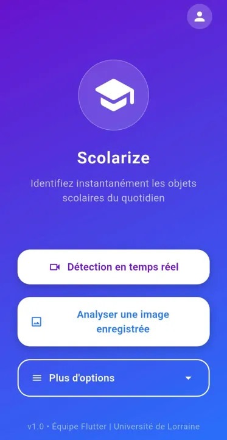

# 🎒 School Object Detector (SAE 5.01)

<p align="center">
	
</p>

> **Projet réalisé en groupe dans le cadre de la SAE 5.01 (Situation d'Apprentissage et d'Évaluation) - Développement Avancé.**

La SAE 5.01 est un module universitaire visant à mettre en pratique des compétences avancées en développement logiciel, gestion de projet, et collaboration. Le but est de concevoir une application innovante en équipe, en suivant un cahier des charges précis, tout en appliquant des méthodes professionnelles (Git, documentation, tests, CI/CD, etc.).

Ce projet a été conçu pour mon portfolio afin de mettre en avant le travail d'équipe, la gestion de l'IA embarquée, et l'intégration de cycles d'apprentissage actif.


## 🖼️ Aperçu du Projet


Vous trouverez toutes les captures d'écran et photos du projet dans le dossier `ImagesAppli` à la racine.

👉 [Voir la galerie complète](Gallery.md)

Pour le portfolio, il est possible d'inclure quelques images directement dans ce README (voir ci-dessous), ou de créer une galerie dédiée.

---

Ce projet a été réalisé dans le cadre de la **SAE 5.01 - Développement Avancé**. L'objectif est de développer une application mobile capable de détecter, identifier et classer des objets du monde réel (ici, du matériel scolaire) en temps réel via la caméra du smartphone.

La particularité de cette application est son cycle d'**Apprentissage Actif (Active Learning)** : les utilisateurs peuvent capturer des images d'objets scolaires mal détectés pour ré-entraîner l'IA et améliorer ses performances au fil du temps.

### 👥 L'Équipe

| Membre | Rôle |
| --- | --- |
| **CHOLLET Thomas** | Développeur |
| **AIT BAHA Said** | Développeur |
| **MORINON Lilian** | Développeur |
| **KERBER Alexandre** | Développeur |


## ✨ Fonctionnalités Principales

* **🕵️ Détection en Temps Réel :** Identification instantanée des objets (stylos, règles, gommes, etc.) via le flux caméra grâce à un modèle YOLOv8 embarqué (TFLite).
* **📸 Collecte de Données :** Interface dédiée pour prendre des photos d'objets spécifiques, générer des datasets et les exporter (ZIP) pour l'amélioration du modèle.
* **🧠 Mise à jour du Modèle :** Possibilité d'importer un nouveau modèle `.tflite` mis à jour directement depuis l'application sans réinstallation.
* **☁️ Cloud & Historique :** Intégration avec Firebase pour le stockage et historique des détections.


## 🛠️ Stack Technique

### Mobile (Flutter)

* **Framework :** Flutter (Dart)
* **Vision par ordinateur :** `flutter_vision` (YOLOv8), `camera`
* **Backend & Data :** Firebase (Core, Firestore, Storage)
* **Utilitaires :** `archive` (Zip), `share_plus`, `path_provider`

### Intelligence Artificielle (Kaggle / Python)

* **Modèle :** YOLOv8 (Ultralytics)
* **Format Mobile :** TensorFlow Lite (Float32)
* **Entraînement :** Scripts Python exécutés sur Kaggle (GPU T4 x2)


## 🚀 Installation et Démarrage

### Prérequis

* Flutter SDK (v3.9.2 ou supérieur)
* Un appareil Android (Les émulateurs ne supportent pas la détection par IA)

### Étapes

1. **Cloner le dépôt :**
```bash
git clone https://github.com/votre-repo/SAE5.01DevAvance.git
cd SAE5.01DevAvance/school_object_detector
```


2. **Installer les dépendances :**
```bash
flutter pub get
```


3. **Configuration Firebase :**
* Assurez-vous que le fichier `google-services.json` est bien présent dans `android/app/` (déjà inclus dans le dépôt, mais à vérifier si vous changez de projet Firebase).


4. **Lancer l'application :**
```bash
flutter run
```


## 🔄 Cycle de Ré-entraînement (Active Learning)

Ce projet repose sur un système de **Crowdsourcing** et d'**Active Learning** : chaque utilisateur peut contribuer à l'intelligence collective de l'application en fournissant des données sur les objets mal détectés. Voir le guide complet ici : [📄 Procédure de Ré-entraînement](R%C3%A9-entrainement/Proc%C3%A9dure.md).

**En résumé :**

1. **Collecte :** Dans l'app, menu "Collecte de données" > Prendre des photos > Exporter. Les données sont envoyées instantanément sur Firebase Storage.
2. **Centralisation :** L'administrateur utilise le script Python `downloadAnnotatedPictures.py` pour récupérer toutes les contributions du mois et générer un fichier `new_data.zip`.
3. **Entraînement :** Sur Kaggle, uploader le `base.zip` (historique) + `new_data.zip` (nouvelles photos) et lancer le script d'entrainement fourni.
4. **Déploiement :** Récupérer le `updated_model.tflite` généré et l'importer sur Firebase. Les utilisateurs n'ont plus qu'à cliquer sur "Importer un modèle" dans l'application pour mettre à jour leur IA.


## 📂 Architecture du Projet

```
SAE5.01DevAvance/
├── Comptes-rendus/                     # Suivi de projet (PDF)
├── Ré-entrainement/                    # Scripts et documentation IA
│   ├── downloadAnnotatedPictures.py    # Script de téléchargement des nouvelles images d'entrainement
│   └── Procédure.md                    # Tutoriel de mise à jour du modèle
├── school_object_detector/             # Code source de l'application Flutter
│   ├── android/                        # Configuration native Android
│   ├── assets/
│   │   ├── icons/                      # Icônes
│   │   └── ml/                         # Modèles TFLite et labels
│   ├── lib/
│   │   ├── screens/                    # Écrans (Camera, Home, Collection...)
│   │   ├── service/                    # Services (Partage, Détection...)
│   │   └── main.dart                   # Point d'entrée
│   └── pubspec.yaml                    # Dépendances
└── README.md                           # Ce fichier
```


## 🤝 Contribution & Workflow Git

Pour travailler sur le projet, merci de respecter le flux suivant :

1. Toujours partir de `main` : `git checkout main && git pull`
2. Créer sa branche : `git checkout -b feature/ma-fonctionnalite`
3. Commit avec des emojis explicites (ex: `:sparkles:`, `:bug:`)
4. Push et créer une **Pull Request** pour validation.